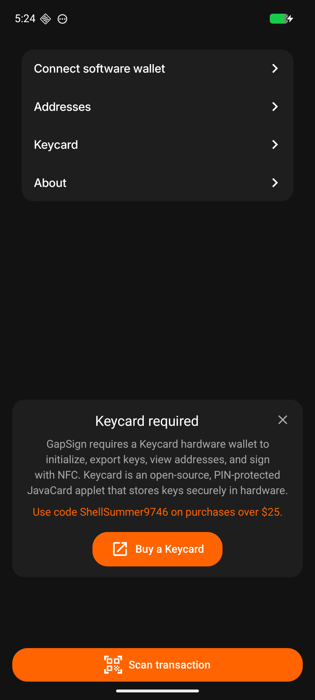
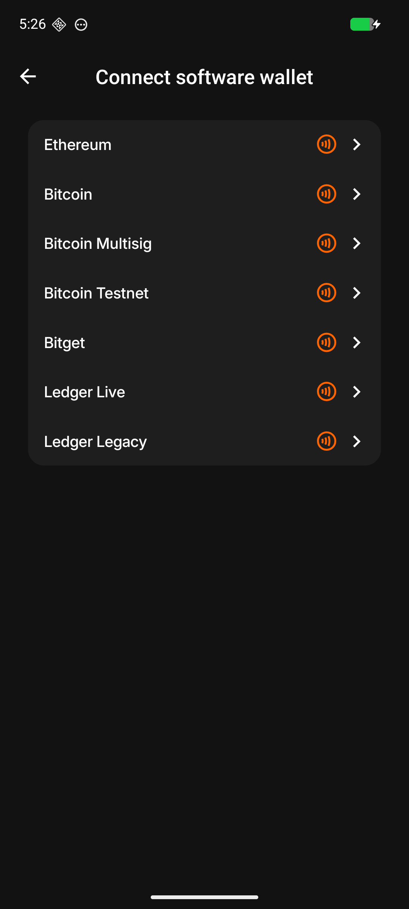
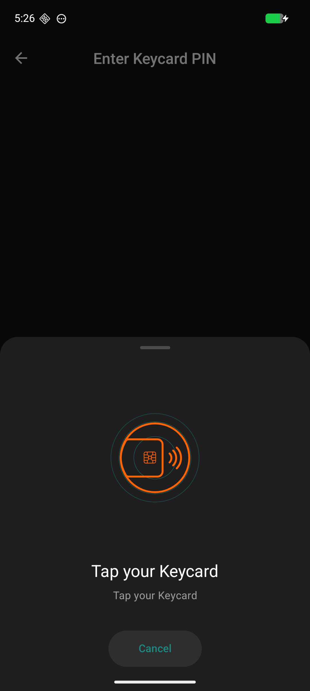
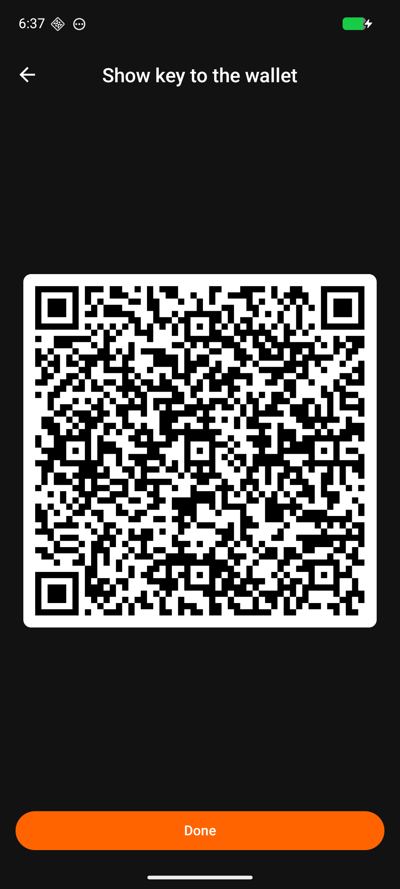
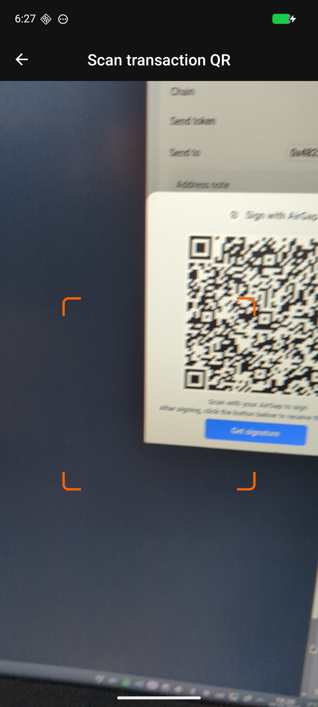
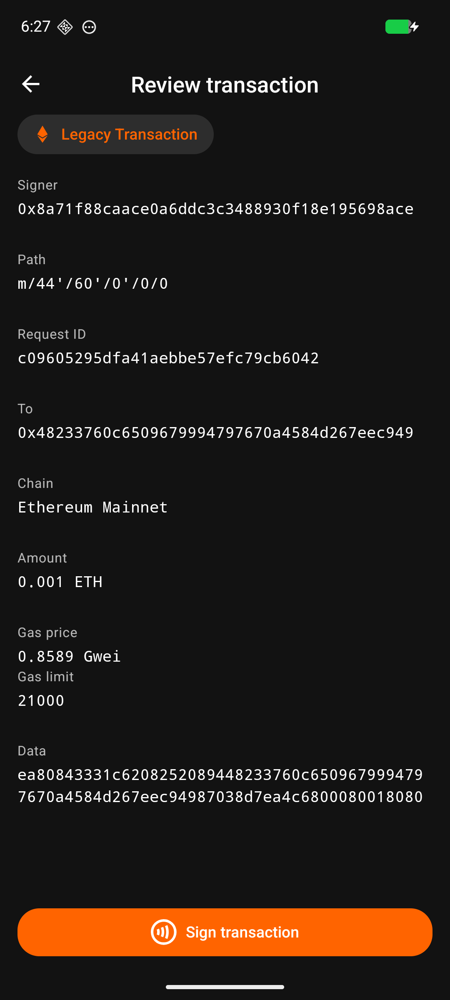
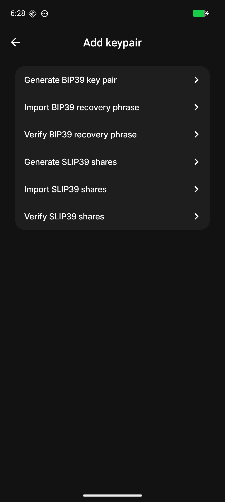
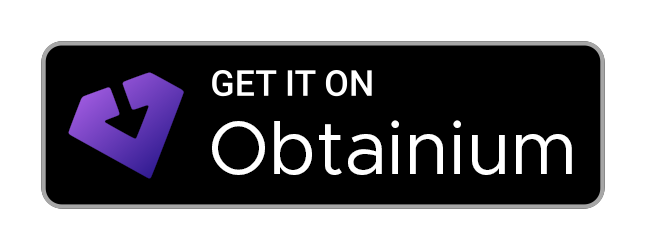

# GapSign

<p align="center">
  
</p>

<p align="center">
  <a href="https://github.com/mmlado/GapSign/actions/workflows/ci.yml"></a>
  <a href="https://github.com/mmlado/GapSign/actions/workflows/android-release.yml"></a>
  <a href="LICENSE"></a>
  <a href="https://developer.android.com"></a>
  <a href="https://reactnative.dev"></a>
  <a href="https://github.com/mmlado/GapSign/releases/latest"></a>
  
  
</p>

GapSign is an air-gapped Android companion app for [Status Keycard](https://keycard.tech). It lets you sign Ethereum and Bitcoin transactions over NFC, so your private keys never touch an internet-connected device.

All communication with your watch-only wallet happens through animated QR codes using the [Blockchain Commons UR](https://github.com/BlockchainCommons/bc-ur) standard. There is no internet permission, no network calls, and no telemetry.

## Screenshots

<p align="center">
  
  
  
</p>
<p align="center">
  
  
  
</p>
<p align="center">
  
</p>

## Features

- Sign Ethereum transactions: legacy, EIP-1559, and EIP-2930
- Sign EIP-712 typed data with a decoded preview before you approve
- Sign personal messages (EIP-191 / SIWE)
- Sign Bitcoin transactions via PSBT
- Sign Bitcoin messages (BIP-322)
- Export wallet keys to MetaMask, Rabby, Ledger Live, Sparrow, BlueWallet, and Bitget
- Generate and load key pairs directly onto the Keycard
- Import a recovery phrase (BIP-39, 12 or 24 words, with optional passphrase)
- Import SLIP-39 Shamir Secret Sharing shares
- Genuine Keycard verification before first pairing
- Fully air-gapped: no internet permission, no network calls, no telemetry

## Requirements

- Android 7.0+ (API 24)
- A [Status Keycard](https://keycard.tech) NFC smart card

## Getting the app

Download the latest APK from [Releases](../../releases) and sideload it onto your device.

<p>
  <a href="https://github.com/mmlado/GapSign/releases/latest">
    
  </a>
  <a href="https://apps.obtainium.imranr.dev/redirect.html?r=obtainium://add/https://github.com/mmlado/GapSign">
    
  </a>
</p>

For most users, install the universal APK. ABI-specific split APKs are also attached to releases for smaller downloads on known device architectures.

### Verification info

- Package ID: `tech.gapsign`
- SHA-256 hash of signing certificate: `A8:3C:11:4B:1F:42:01:DA:FB:D0:3E:22:1F:1C:29:28:EC:B5:2B:78:BD:A5:E9:3F:29:6F:ED:F2:29:8E:54:6B`
- `SHA256SUMS.txt` is attached to each GitHub Release to verify APK file hashes.

### Install with Obtainium

1. Install [Obtainium](https://github.com/ImranR98/Obtainium).
2. Add `https://github.com/mmlado/GapSign` as a GitHub app source.
3. Use GitHub Releases as the update source.
4. Select the universal APK from the latest release.

> The APK is built automatically by GitHub Actions on every version tag. F-Droid distribution is coming.

## Building from source

### Prerequisites

- Node.js 20+
- JDK 17
- Android SDK with NDK 27.1.12297006

### Setup

```sh
npm install
```

### Run (development)

```sh
npm start        # Terminal 1: Metro bundler
npm run android  # Terminal 2: build and install
```

### Release build

```sh
cd android && ./gradlew assembleRelease
```

## Development

```sh
npm test      # Jest test suite
npm run lint  # ESLint
```

## Support development

If GapSign is useful to you, voluntary donations help support ongoing open-source development.

- Ethereum: `0xF665E3D58DABa87d741A347674DCc4C4b794cAc9`
- Bitcoin: `bc1qpncfjnresszndse506zmvjya05xcs6493cm8xf`

## Security

- Pairing data is stored in encrypted storage backed by the Android Keystore
- Private keys never leave the Keycard; only the signature result is returned to the app
- QR codes use [Blockchain Commons UR](https://github.com/BlockchainCommons/bc-ur) for structured binary encoding
- No internet permission in release builds

## License

MIT
